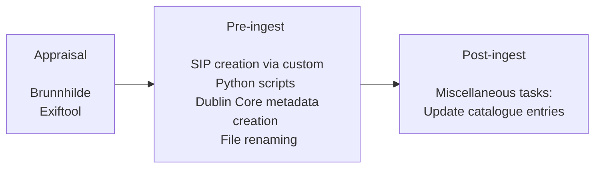

# Standard ingest workflow

This page covers the appraisal and pre-ingest workflows before an asset is ingested into Preservica.

## Appraisal

### [Brunnhilde](https://github.com/tw4l/brunnhilde)

- Brunnhilde provides the three following features.

    - virus check
    - file analysis
    - checksums

- Run Brunnhilde using the following in cmd:

            brunnhilde.py source destination

- `source` being the path to source directory or disk image  
  `destination` being the path to destination for reports  
  Check for any complications such as 0 sized files and duplicates.

### [ExifTool](https://exiftool.org/#running)

- Exiftool lists the properties of a document in a csv to be human readable. The following properties will be included: title, author, subject, keywords, producer, CreateDate, ModifyDate, FileName.
- Check the title properties, if the titles are misleading or completely incorrect. Strip the metadata from the file if any are found to be misleading or completely incorrect.

- Run Exiftool using the following in cmd:

        exiftool -csv -r -T -Title -Author -Subject -Keywords -Producer -CreateDate -ModifyDate -FileName "input file/folder" > "output.csv"

**TODO: Cover how to strip metadata from PDFs, doc, docx etc. here.**

## Pre-Ingest

### Prepare a Submission Information Package (SIP)

- Creating a SIP requires: Fixity, Dublin Core descriptive metadata and the digital artefacts.
- For Fixity ICAEW uses the SHA-1 algorithim.
- Refer to the [Dublin Core](./dublin-core.md) page to understand how ICAEW uses it.

## SIP

- Each of these elements are placed in a folder, the fixity and descriptive metadata are nested in an .opex metadata template beside the digital artefact they represent.
- Each artefact including the folder must have a seperate .opex metadata document.
- The folder level .opex metadata document is unique to the other .opex files, its primary role is to include a manifest of the folder: both content and metadata.

### Python SIP creation tools

We have multiple tools that achieve the objective of creating a Preservica SIP. The tools can be found on the [icaew-digital-archive](https://github.com/icaew-digital-archive/digital-archiving-scripts/tree/main/opex-scripts) GitHub page.

- **Tool A**: creates a .csv file with seperate SHA-1 hashes for each artefact and includes relevant dublin core fields to populate for the .opex metadata file.

        a_files_to_csv.py [-h] [--hash_type {sha1,md5}] directory output
Populate the .csv with the relevant Dublin Core metadata - leaving the Subject fields for the next stage of the process.

- **Semaphore auto-classification (via semaphore-helper.py)**

        usage: semaphore-helper.py [-h] [--preservica_ref PRESERVICA_REF] directory
Make use of Semaphore's Classification Server via semaphore-helper.py. This script acts as a wrapper around the Semamphore CLS client and outputs a maximum of 10 subject topics, sorted by scoring. The script accepts a local directory or a preservica folder reference can be supplied directly to the script. Further information regarding the Semaphore CLS client can be found [here](./auto-classification.md). After populating the .csv with the relevant dublin core metadata, move on to the rename tool.

- **Rename tool**: renames the original filenames (found in the 'filename' column) to filenames given in the 'Title' column from the csv produced by a_files_to_csv.py. Use the output CSV file from semaphore-subject-import.py (unless the step was skipped for whatever reason).

        csv_file_rename.py file_directory csv_file_path
After using the script to rename the files, move on to Tool B.  
**Note: after running the script you should also copy the contents of the 'Title' field over to 'filename' in the csv file as Tool B uses this column to name the .opex files. You will also need to re-add the file extensions if following this method.**

- **Tool B**: uses the completed .csv to create unique .opex metadata files for each digital artefact in the folder. Including fixity and dublin core metadata.

        b_csv_to_opex_xml.py csv_file output_dir
After this tool has successfully created a .opex metadata file for each digital artefact, move on to Tool C.

- **Tool C**: creates a folder level .opex metadata document. It scans the parent folder and creates an authenicated folder level .opex metadata document that serves as a manifest for the ingest. The folder level opex file can then be edited before ingest if needed, i.e. adding/changing the Title, Description, SecurityDescriptor and other Dublin Core metadata.

        c_folders_of_files_to_folder_opex_xml.py folder_path

## Post-ingest

**TODO: Write post-ingest processes**

## Appendix:

Processes that are no longer used.

- **Semaphore CLS Client and semaphore-subject-import.py**

  The semaphore-subject-import.py script combines the CSV output from the Semaphore CLS Client, negating the need for copy and pasting from one CSV to the other. Usage is as follows:

        semaphore-subject-import.py semaphore_csv dublin_core_csv csv_output
