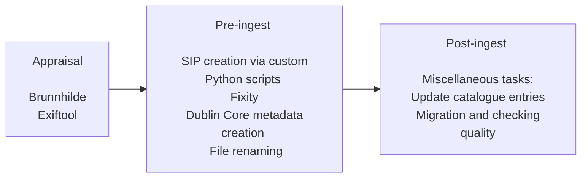

# Standard Ingest Workflow

> **Purpose:** This page outlines the critical steps of appraisal and pre-ingest processes that are followed before an asset is ingested into **Preservica**. These workflows ensure thorough evaluation, metadata assignment, and asset preparation to maintain integrity and compliance throughout the digital preservation lifecycle.

> **Note:** This page is under development. Future additions will include:
> - Prerequisites section
> - Required Tools section
> - Step-by-Step Guide section
> - Quality Checks section
> - Troubleshooting section
> - Best Practices section



### Workflow Breakdown:

- **Appraisal**: Tools like **Brunnhilde** and **Exiftool** are used to evaluate and assess the digital assets for preservation.
- **Pre-Ingest**: Preparation steps include creating **SIP (Submission Information Packages)** through custom Python scripts, performing fixity checks, adding **Dublin Core** metadata, and ensuring proper file renaming.
- **Post-Ingest**: After ingestion, miscellaneous tasks such as updating catalogue entries, migration, and quality checking are performed to ensure asset integrity and accessibility.

```