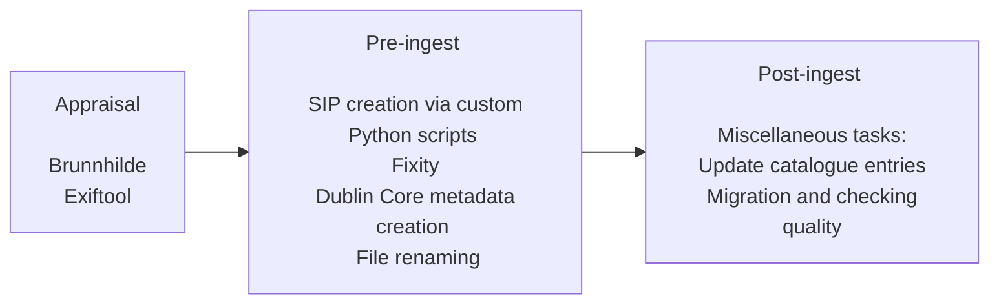

# Standard ingest workflow

This page covers the appraisal and pre-ingest workflows before an asset is ingested into Preservica.

```mermaid
flowchart LR
    id1[Appraisal \n\n Brunnhilde \n Exiftool] --> id2
    id2[Pre-ingest \n\n SIP creation via custom Python scripts \n Fixity \n Dublin Core metadata creation \n File renaming] --> id3[Post-ingest \n\n Miscellaneous tasks: \n Update catalogue entries \n Migration and checking quality]
```
