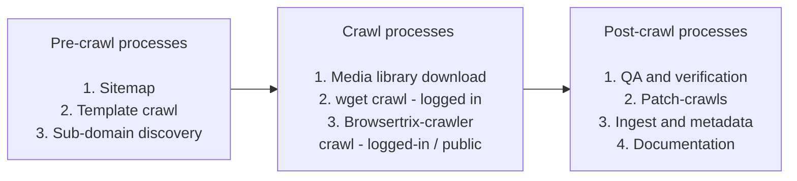

# Web Archiving Process Overview

> **Purpose:** This page outlines a full web capture of ICAEW.com crawl (logged-in / public) but the general process should apply to most other websites.

## High-level overview



### Preservica folder structure

> **Important:** The following shows an example of a complete crawl within Preservica. Web crawls should follow this structure. All items should be closed with the exception of the .wacz file.

```
ICAEW.com, April 2025/
├── 20250401-ICAEW-com-logged-in.wacz
├── Supplementary Materials/
│   ├── seedFile.txt [Mandatory if a seedFile.txt file was used]
│   ├── 20250401-ICAEW-com-logged-in-wget.zip [Optional]
│   ├── 20250401-ICAEW-com-media-library.zip [Optional]
│   ├── QA/
│   │   ├── wacz_matching_urls_20250401_145826.csv [Optional]
│   │   ├── wacz_missing_urls_20250401_145826.csv [Optional]
│   │   ├── wacz_non_200_urls_20250401_145826.csv [Optional]
│   │   ├── wget_matching_urls_20250401_145826.csv [Optional]
│   │   ├── wget_missing_urls_20250401_145826.csv [Optional]
│   │   ├── wget_non_200_urls_20250401_145826.csv [Optional]
│   │   ├── notes.txt [Optional]
```

## Process Overview

### Pre-crawl processes

#### 1) Sitemap

> **Purpose:** Save a copy of the ICAEW sitemap for:
> - Input to the web crawlers
> - Post-crawl QA / validation

Use [sitemap_xml_to_txt_or_html.py](https://github.com/icaew-digital-archive/digital-archiving-scripts/blob/main/sitemap%20tools/sitemap_xml_to_txt_or_html.py) with the following arguments:

```bash
python3 sitemap_xml_to_txt_or_html.py \
    --to_file seedFile.txt \
    https://www.icaew.com/sitemap_corporate.xml \
    --exclude_strings "sprint-test-pages" "active-members" \
    --deduplicate
```

#### 2) Request a list of templates and do a template crawl

> **Tip:** Before running a full crawl, it's important to test how the crawler handles various templates and elements on the site - especially new ones. This helps identify potential issues with capture and playback.

- Request any new additional templates be added to this document: [Sitecore templates and examples ](https://icaew.sharepoint.com/:w:/s/digitalarchive/EY-WRGmke3VGmyYkTdEDDYMBfZ5nyLgefubtdJNa4WMfDQ?e=CMGN8D&CID=db808ef5-54c9-52fb-079f-87384e3ca7aa&ovuser=30a7efd6-7f05-437d-bc19-e7c6df3892f1%2CCraig.McCarthy%40icaew.com&clickparams=eyJBcHBOYW1lIjoiVGVhbXMtRGVza3RvcCIsIkFwcFZlcnNpb24iOiIxNDE1LzI1MDMwMjAxMDEwIiwiSGFzRmVkZXJhdGVkVXNlciI6ZmFsc2V9)

- Complete a template crawl

    - This is covered on the Browsertrix-crawler page [here](../web-archiving/browsertrix.md).
    - **Optional:** If problematic elements are identified during the template crawl, consider writing custom behaviors for the web crawler. This is outlined further [here](../web-archiving/browsertrix-behaviors.md).


#### 3) Sub-domain discovery

**Optional:** Use the [crt-scraper.py](https://github.com/icaew-digital-archive/digital-archiving-scripts/blob/main/web%20crawling/crt-scraper.py) script to discover new sub-domains that may not be included in a full ICAEW.com capture. This helps ensure comprehensive coverage of all ICAEW web properties.

### Crawl processes

#### 1) Media library download

**Prerequisites:**
- Access to the VDI
- Sitecore login credentials (available on the Logins page)

**Steps:**

1. Log into the Sitecore backend
2. Navigate to the "Media Library"
3. Right-click the root level folder ("Media Library")
4. Select "Scripts" and then "Download"

> **Important Notes:**
> - The download process may take several hours
> - The resulting zip file can be upwards of 10 GB
> - Only media stored directly in Sitecore will be downloaded. External media (e.g., Vimeo, StreamAMG) will not be included


#### 2) wget crawl

Perform a wget-based crawl to create a backup copy of the website. This provides an alternative capture method and can be useful for verification purposes.

- Detailed instructions are available on the [wget page](../web-archiving/wget.md).

#### 3) Browsertrix-crawler - logged-in / public crawls

Execute the primary crawl using Browsertrix-crawler. This creates the main WACZ file that will be ingested into Preservica.

- For logged-in crawls: Requires browser profile creation with authentication cookies
- For public crawls: No authentication required
- Detailed instructions are available on the [Browsertrix-crawler page](../web-archiving/browsertrix.md).

### Post-crawl processes

#### 1) Quality Assurance and Verification

Perform comprehensive QA checks to validate the crawl completeness and quality:

- Run validation scripts to compare crawled URLs against the sitemap
- Generate QA reports (matching URLs, missing URLs, non-200 status codes)
- Review and investigate any missing or problematic URLs
- Verify WACZ file integrity and playback functionality

Detailed QA processes are covered on the [wget page](../web-archiving/wget.md) and the [Browsertrix-crawler page](../web-archiving/browsertrix.md).

#### 2) Patch crawls

> **Conditional:** If QA reveals missing URLs or problematic pages, perform targeted patch crawls to capture the missing content:

- Create a new seed file containing only the problematic URLs
- Run a patch crawl using a one-hop configuration (only crawls URLs in seed file plus one hop for linked resources)
- This prevents re-crawling the entire site while capturing missing content
- Detailed instructions are available in the [Browsertrix-crawler patch crawl section](../web-archiving/browsertrix.md#icaewcom-patch-crawl)


#### 3) Ingest to Preservica

Upload all crawl materials to Preservica following the established folder structure:

- Upload to Preservica using the [AWS client](../preservica/aws-cli.md)
- Replicate the [Preservica folder structure](#preservica-folder-structure) as outlined above
- Ensure all items are closed with the exception of the .wacz file

> **Post-ingest verification:**
> - Verify fixity values match using:
>   ```bash
>   sha1sum [FILE]
>   ```
> - Test playback of the WACZ file in Preservica's Portal to ensure proper rendering

#### 4) Write basic metadata in Preservica

Add essential metadata to the crawl asset in Preservica to ensure proper discovery and access:

- Follow this example: [ICAEW.com, April 2025](https://icaew.access.preservica.com/portal/asset/sdb%3AIO%7Cd5c70515-474b-4858-b8e9-fcc9f8e6c64c)
- Include capture date, crawl type (logged-in/public), and any relevant notes

#### 5) Documentation

Update relevant documentation to track the crawl completion:

- Update the [ICAEW platform register](https://icaew.sharepoint.com/:x:/r/sites/digitalarchive/_layouts/15/Doc.aspx?sourcedoc=%7B17C4654A-615F-4E26-8FF9-B309DEB01339%7D&file=ICAEW%20platform%20register.xlsx&action=default&mobileredirect=true) document with the latest capture dates
- Document any issues encountered or special considerations in the crawl notes

#### 6) Upload public ICAEW.com capture to Archive-It

**TODO:** Upload the public ICAEW.com capture to Archive-It for public access.