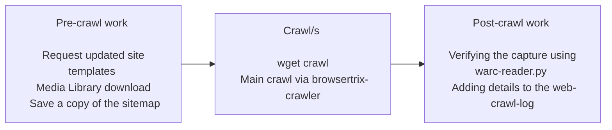
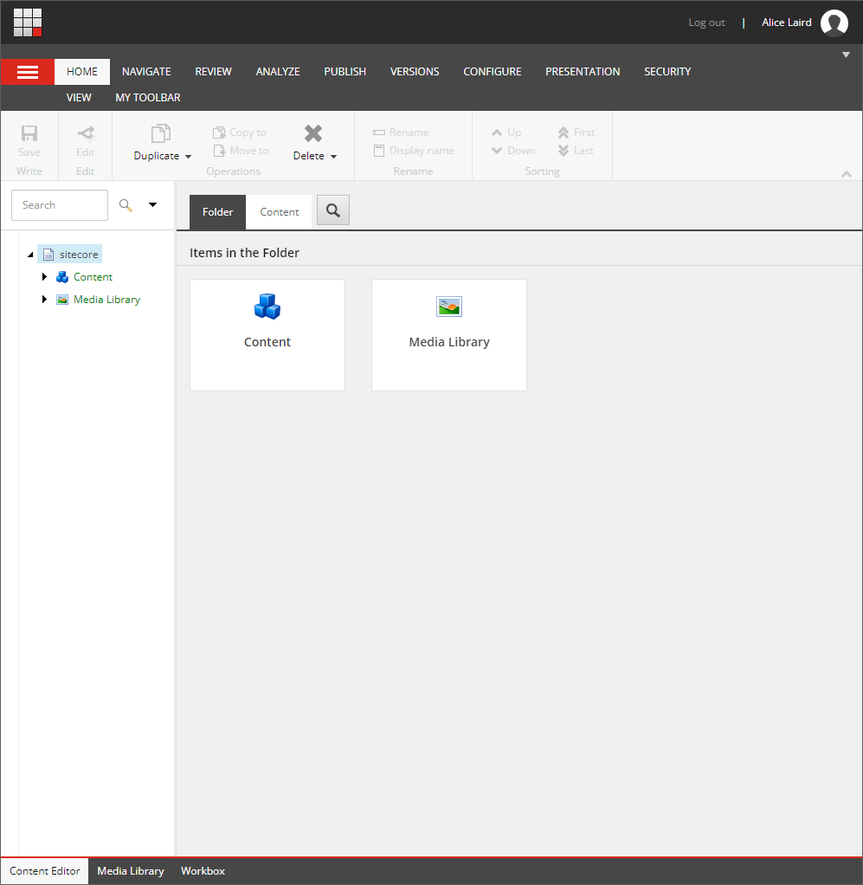
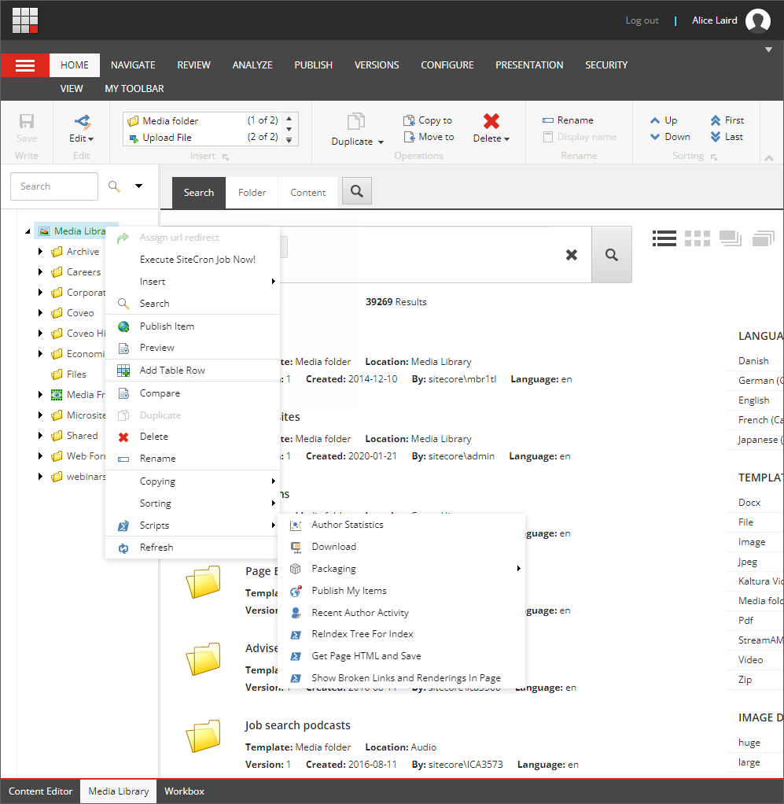

# Web crawl process overview

This page outlines how to create a full archival capture of ICAEW.com. However, the methods and techniques will be applicable for archiving other websites.

Generally the workflow will be as follows:

## Pre-crawl work

### Request updated site templates

- Request a list of new templates that may have been added to the site since the last crawl. Check for problems that they may present for capture/playback via browsertrix-crawler and ReplayWeb.page
- At this point it might warrant investigating the writing of custom behaviors for the web crawler. This is outlined further on the [browsertrix custom behaviors](./browsertrix-behaviors.md).

### Media Library download

Log into the backend of Sitecore [here](http://master.icaew.com/sitecore/login).

The login credentials can be found at the [Logins page](../../logins.md).

Navigate to the Media Library by selecting it via the bottom toolbar.

Right click the root level folder, i.e., “Media Library”. Select Scripts and then Download. The process will take quite a while and will result in a ~10 GB zip file that contains the media content that is being stored directly in Sitecore. It will not download items that a linked to from other media content providers such as Vimeo and StreamAMG.

You should see the following -

Once the download is complete, ingest to Admin/Private Repository/Web Captures/Sitecore Media Library Downloads, following the established naming convention for the file. **LINK TO AWS PAGE**

### Saving a copy of the ICAEW.com sitemap

A copy of the sitemap is saved for multiple reasons:

- To help the crawls via input to wget and browsertrix-crawler
- For post-crawl testing, to ensure all URLs have been crawled
- For future reference, as a record of what the crawls/WARC files contain

The following script can be used to produce the sitemaps in .txt format: [sitemap_xml_to_txt_or_html.py](https://github.com/icaew-digital-archive/digital-archiving-scripts/blob/main/sitemap%20tools/sitemap_xml_to_txt_or_html.py).  

The script requires the 'requests' library to be install via:  

        pip install requests

#### Example sitemap_xml_to_txt_or_html.py usage

The following outputs a list of URLs from the sitemap to a text file with pages that contain "sprint-test-pages" or "active-members" exluded:

        python3 sitemap_xml_to_txt_or_html.py --to_file 202XXXXX_sitemap.txt https://www.icaew.com/sitemap_corporate.xml https://www.icaew.com/sitemap_careers.xml  --exclude_strings "sprint-test-pages" "active-members"

The .txt file should be ingested into Preservica at Admin/Private Repository/Web Captures/ICAEW-com-sitemaps. **Consider whether this is necessary? WACZ captures already contain a pages.jsonl file**

## Crawls

### Wget crawl

Information regarding the setup and use of browsertrix-crawler can be found on the [wget](./wget.md) page.

### browsertrix-crawler

Information regarding the setup and use of browsertrix-crawler can be found on the [browsertrix-crawler](./browsertrix.md) page.

## Post-crawl work

### warc-reader.py

The WARC reader script (as found here - [https://github.com/craiglmccarthy/web-archiving-scripts/blob/main/warc-reader.py](https://github.com/craiglmccarthy/web-archiving-scripts/blob/main/warc-reader.py)) is used to check the sitemap against the capture.

The script needs to be edited here:

        # URL_LIST is most likely going to be a sitemap 'snapshot'
        URL_LIST = ''
        # WARC_FOLDER_PATH is a path to a folder containing WARC files
        WARC_FOLDER_PATH = ''
        # CSV_FILENAME is the filename for the CSV output
        CSV_FILENAME = ''

The URL_LIST should point to a .txt file of URLs, i.e. the 202XXXXX_sitemap.txt created earlier in the crawl process. WARC_FOLDER_PATH should point to a folder containing WARC files. CSV_FILENAME is the name of .csv file output.

### web-crawl-log

Lorem ipsum dolor sit amet, consectetur adipiscing elit. Suspendisse neque lacus, lacinia nec justo ac, mattis semper nisl. Integer scelerisque sem ornare, ornare eros varius, ullamcorper eros. In rhoncus sodales libero sed lacinia. Sed malesuada pretium sem et semper. Pellentesque ultricies sapien justo, ut malesuada eros suscipit ut. Nullam aliquet, ante nec condimentum malesuada, enim mi placerat tortor, sit amet hendrerit enim sem sit amet tellus. Etiam sodales lacus velit, non sollicitudin enim sagittis eget. In hac habitasse platea dictumst. Aliquam semper sodales ante, non ullamcorper sapien hendrerit non. 