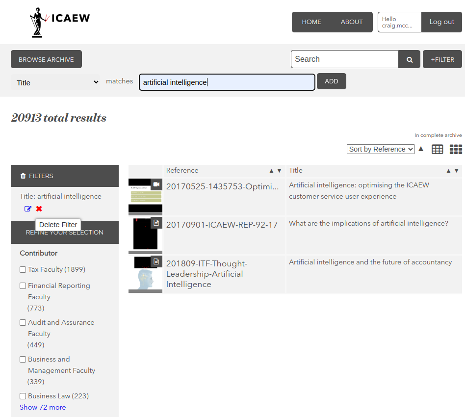

# Accessing and Searching Preservica

## Access

### Two methods of access

> **Purpose:** There are two methods of accessing / searching Preservica:

- **Preservica user access portal:** [https://icaew.access.preservica.com/](https://icaew.access.preservica.com/)
- **Links from the library catalogue**

> **Example:** An example from the library catalogue - [http://libcat.icaew.com/uhtbin/cgisirsi/x/0/0/57/5/0?searchdata1=102535%7BCKEY%7D&searchfield1=GENERAL%5ESUBJECT%5EGENERAL%5E%5E&user_id=WEBSERVER](http://libcat.icaew.com/uhtbin/cgisirsi/x/0/0/57/5/0?searchdata1=102535%7BCKEY%7D&searchfield1=GENERAL%5ESUBJECT%5EGENERAL%5E%5E&user_id=WEBSERVER); the Preservica link links directly to the document from the Electronic Access (856) field.

> **Note:** Currently the catalogue records contain far more detailed notes/metadata than the Preservica entries.

### Always ensure that you are logged in

> **Important:** Before proceeding with either access method, you should ensure that you are logged in (unless you are absolutely certain that you are looking for an item in a public collection). An overview of the restricted / public collections is available [here](../preservica/preservica-overview.md).

> **Note:** If you are not logged in, you will either not see the restricted content at all or will be met with a message "You must be logged in to the ICAEW Digital Archive to view this content".

> **Access Request:** If you do not have a Preservica account, please request one from the Digital Archive Manager / Digital Archivist.

## Search

### Searching via the Preservica web portal

#### Standard search

> **Note:** Searching via the library catalogue or libcat is not covered in this guide.

**Discovery can be made in two ways in Preservica:**
- Navigating directly through the folder hierarchies
- Using the search functionality, including full-text search, filters, and facets

> **Tip:** The search bar in the web portal is by default a **full-text search**. Therefore, in most cases it will be sensible to use quotation marks to search for phrases, unless your search term is very specific. For example, searching **making tax digital** or **"making tax digital"** will yield ~1500 and ~640 results respectively. It is more likely that the second approach will return more relevant results.

You are able to further refine your search by clicking on the facets that appear in the left "REFINE YOUR SELECTION" column and by clicking on the "+FILTER" button to bring down a menu where you can apply filters.

Currently there are four filters that you can apply:

- Title
- Date
- ICAEW Department
- File name

#### Searching via the filters only

> **Tip:** Sometimes it may be useful to search Preservica using _only_ a filter. The most useful filter will often be the Title field.

> **Note:** The following process is not particularly intuitive but it works.

**The first step** is to click the search icon in the navigation bar. This in effect searches for an empty string and will return _all_ of the content in Preservica.

After this you should see that Preservica returned a large number of results (in the example below ~21,000, this includes a number of items only available in the Admin area viewable only by the Digital Archive Manager / Digital Archivist).

From this screen you can then apply a filter to search  via the _Title field only_. 

In the following example, you can see that Preservica contains 3 documents with "artificial intelligence" in the Title metadata.

> **Note:** Currently there are a lot of Preservica documents missing the Title metadata. However, in the future the Title metadata will be added for all Preservica content, making this search method more usable.