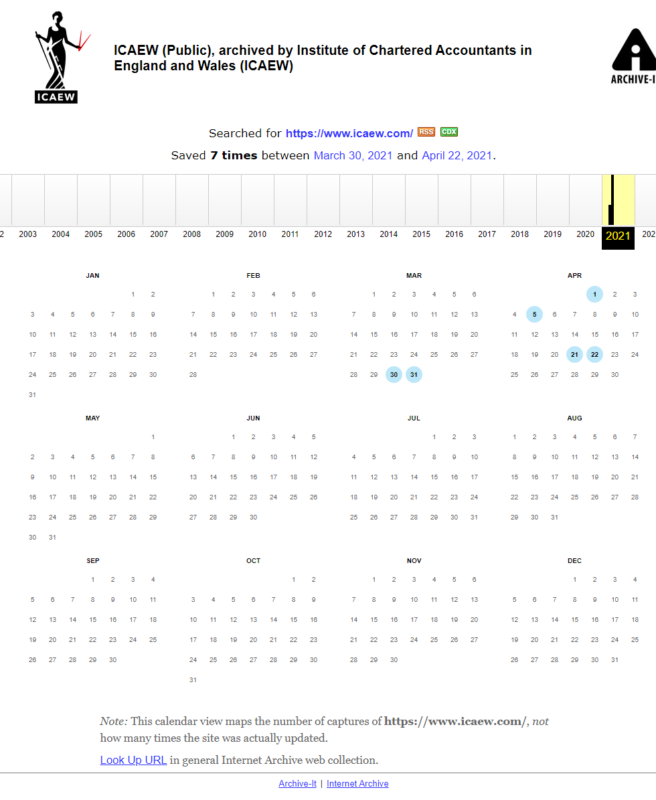
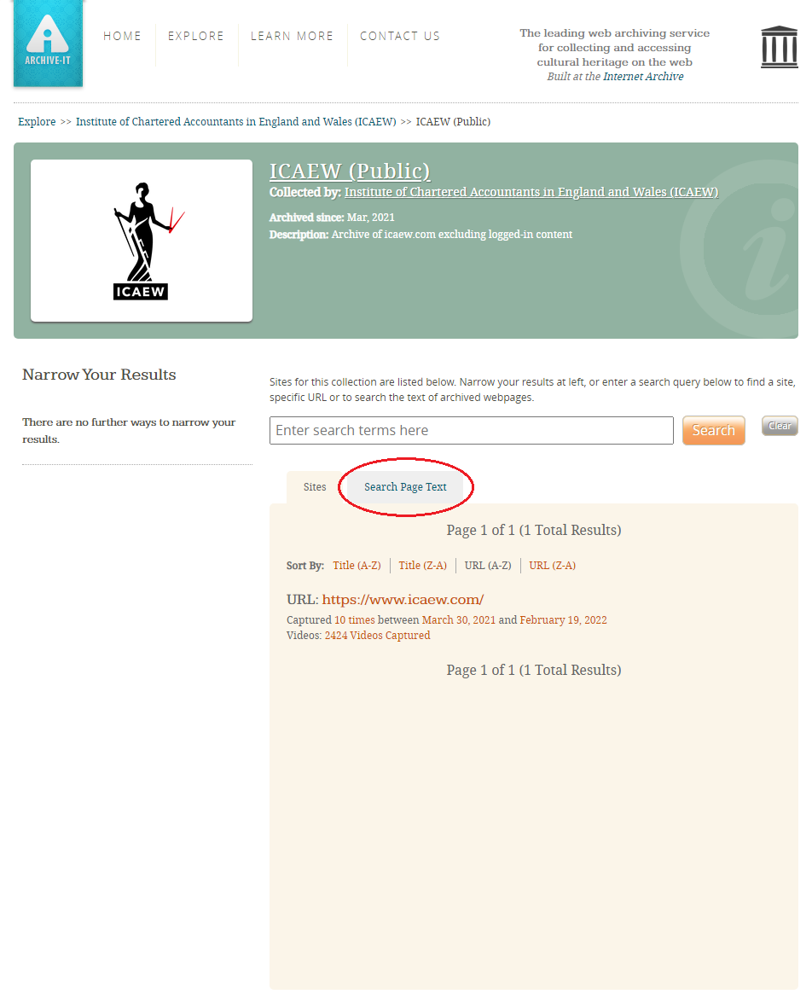
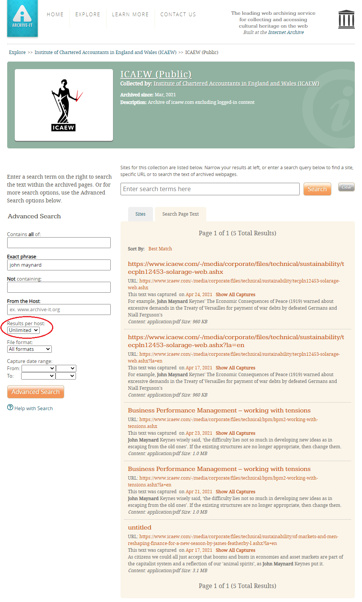

# Accessing / searching the web archives

## Overview of what is captured and how
This guide will focus primarily on the full ICAEW.com captures but should also be relevant for other web captures - Economia, Coronavirus Hub, ION etc. A complete list of web collections is available [here](../web-archiving/web-archive-overview.md).

The ICAEW.com captures are split into **public** or **restricted** captures. Public captures are a full crawl of the website from a ‘public view’ - i.e., the crawler didn’t have access to pages behind the login. Restricted captures are a full crawl of the website from a ‘logged-in’ perspective – i.e., the crawler had access to pages behind the login.

A full capture of the ICAEW.com consists of the following:

- A public capture in that is hosted by Archive-It (WARC/Web Archive format). Accessible to the public and staff.

- A restricted capture that has been made locally and has been ingested into the admin area of Preservica (WARC/Web Archive format). Accessible to staff for offline viewing via [https://replayweb.page/](https://replayweb.page/)</a>.

- A restricted capture made using the wget crawler with assets saved in their native formats, i.e., HTML, CSS, JS etc. This crawl is primarily made a backup for the other two crawls. Only available to view offline via the digital archiving workstation.

- A full media library download from Sitecore which has been ingested into the admin area of Preservica. The media library download contains all public/private media content that is hosted on Sitecore at the time of download. Not readily accessible, however, the digital archivist can access the downloads if needed.

## Is a web capture the best place to look for archived content?
Web crawls are primarily carried out to capture the ICAEW.com website at a specific point of time - with a particular emphasis on capturing the HTML pages. Web crawls should also include all the media content (PDFs, DOCXs etc.). They generally do not include video/audio content which is often streamed from external services (Vimeo, StreamAMG etc.).

However, even though web captures will contain a substantial amount of media content, Preservica will generally be the best access point for this sort of material. The collections on Preservica have been curated, should be more complete (items having been sourced from places other than the website), and have had additional metadata written to allow for better access 
and discovery.

## Looking for content when the URL is known

### Public captures hosted by Archive-It
All web collections on Archive-It have a collection id. The collection id for the ICAEW.com 
public capture is: 16306

All Archive-Its URL follows this pattern:

[https://wayback.archive-it.org/16306/*/https://www.icaew.com/](https://wayback.archive-it.org/16306/*/https://www.icaew.com/)

The URL above describes a capture of **"https://www.icaew.com/"** in **collection 16306**, and the **\*** designates a ‘wildcard’ search where the timestamp would normally appear in direct Archive-It links (rather than going via an index).

The above link will take you to an index page of archived versions of ‘https://www.icaew.com/’. In this example ‘https://www.icaew.com/’ has been archived 7 times. To access the archived page, you will need to click on a date in the calendar – 

Put simply, to check whether the Archive-It public capture contains a URL you 
need to prepend your URL of interest with - **https://wayback.archive-it.org/16306/*/**

For example, if needing to check whether ‘https://www.icaew.com/technical/Technology/Artificial-intelligence’ has been 
captured, you would prepend the URL with https://wayback.archive-it.org/16306/*/ to make the full Archive-It URL - [https://wayback.archive-it.org/16306/\*/https://www.icaew.com/technical/Technology/Artificial-intelligence](https://wayback.archive-it.org/16306/\*/https://www.icaew.com/technical/Technology/Artificial-intelligence)

Opening the full archive URL will lead you to an index page (like in the example above) which will show you how many times the page has been captured, when it was captured and will provide access points to the archived page.

If the page is not present in the web collection you will see this page –

### For captures predating the Archive-It captures

For captures predating the Archive-It captures, it will often be useful to search the public [Internet Archive - Wayback Machine](https://archive.org/web/) by entering the URL into the search box. However, you can also take the same approach of prepending your URL with **https://web.archive.org/web/*/** similar to above.

For example, if needing to check whether ‘https://www.icaew.com/technical/Technology/Artificial-intelligence’ has been captured by the Internet Archive, you would prepend the URL with https://web.archive.org/web/\*/ to make the full Internet Archive URL - [https://web.archive.org/web//*/https://www.icaew.com/technical/Technology/Artificial-intelligence](https://web.archive.org/web/*/https://www.icaew.com/technical/Technology/Artificial-intelligence)

### Restricted captures held offline/locally

Restricted captures are currently available for viewing via [https://replayweb.page/](https://replayweb.page/). To view the offline captures you first need to load them into the web app. The web captures are currently held here: W:\DA\Web Archive Replay\WACZ-files

## Searching the captures
### Searching the public Archive-It capture
The public Archive-It capture allows for full-text search. This is contrast with the public Internet Archive captures, there is no full-text search capability.  

Searching the capture is made from this page - [https://archive-it.org/collections/16306](https://archive-it.org/collections/16306)

To begin searching via full-text click on “Search Page Text”.

After this, ensure that “Results per page” is set to Unlimited. You can enter your search query 
in either “contains all of”, “exact phrase” or “not containing”, or in a combination of your 
choosing.  

There is also an option to filter by date ranges. Once your search criteria has been entered you click on the “Advanced Search” button to begin the search. For more information regarding search, a guide is available here - [https://support.archive-it.org/hc/en-us/articles/208002196-Browse-and-search-on-archive-it-org#Usingsearch](https://support.archive-it.org/hc/en-us/articles/208002196-Browse-and-search-on-archive-it-org#Usingsearch)

## Instances when you cannot find what you are looking for

There may be instances when you are unable to locate what you are looking for. This may be due to a few reasons:

- There may have been problem at the time of crawl. For instance, the crawler may have visited a page and received a 404 error, or the crawler didn’t capture a HTML/JavaScript element correctly which has resulted in a non-functional/missing page.

If you are unable to locate what you are looking for, contact the Digital Archive Manager or Digital Archive Assistant. They will be able to look in the restricted capture and/or the Sitecore media library download.